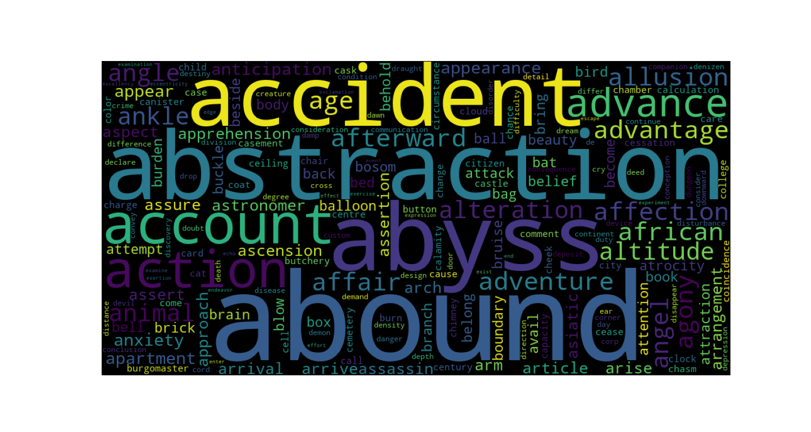

# Sentence Autocomplete

This is a text generator application developed in June 2024 as a second Computational Intelligence project.

It trains two models, one based on LSTM network and second on pre-trained GPT-2, on Edgar Allan Poe's tales. Application takes a prompt and generates the rest of the text.

### Dependencies

`Python` `Tensorflow - Keras` `Transformers - PyTorch` `NLTK` `Scikit-Learn`

To install all the required packages, run **`pip install -r requirements.txt`**

### Basic usage

`./eapoe-data` contains 7 Poe's tales downloaded from [Project Gutenberg](https://www.gutenberg.org/cache/epub/25525/pg25525-images.html). They are merged into one file `./poe-tales.txt` in preprocessing.

There are three ways of running the program:

```sh
python main.py -t
# or
python main.py --train
```

It lets user decide which model to train - LSTM or GPT-2. LSTM network is trained on 65 epochs and GPT-2, because it was made as an experiment, on 3. 

```sh
python main.py -r
# or
python main.py --run
```

It runs the main application for LSTM or GPT-2 model. They both run in a loop that can be left after entering 'exit' as a prompt. In LSTM version you can also choose to generate a random prompt.

```sh
python main.py -p
# or
python main.py --plot
```

It makes additional plots such as 15 most common words and word cloud. They are saved to `./plots` directory.

### Results

The best generations were achieved in 64th epoch of LSTM with the loss of 3.8821, where model started generating better sentences. From 65th epoch there were significant regress, as it started repeating words more often.

GPT-2 trained on Poe's tales does good, but if trained on more epochs, definitely could create better sentences.

Word cloud shows that there are a lot of words beginning with A in the tales.



In conclusion, there is a potential for both models. If trained on more epochs, they could generate great sentences.